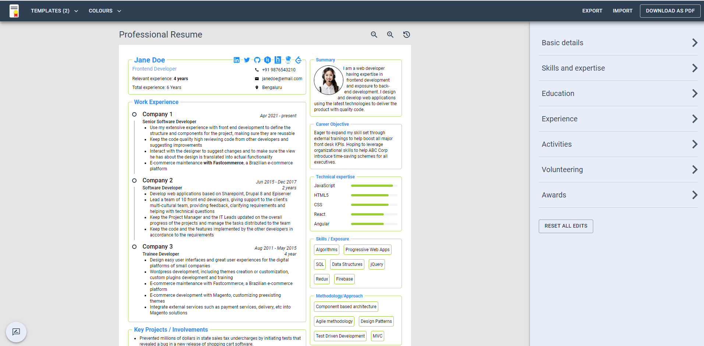

<div align="center">

## Resume Builder

<a href="https://eresume-builder.vercel.app/">

[](https://nextjs.org/)
[](https://mui.com/)
[](https://tailwindcss.com/)
<a href="https://github.com/pmndrs/zustand"></a>

</div>

## Live URL
https://eresume-builder.vercel.app

## About

Resume Builder is an open-source application where one can effectively build a single-page professional resume.

Features:

- Customise with templates and themes!
- Simple interface that helps you build quickly!
- No sign-up needed — go straight to the building!
- Your data never leaves your device

# Getting Started
Download and install Node.js on your computer (https://nodejs.org/en/download/).

Then, open VSCODE, drag the project folder to it. Open VSCODE terminal and install dependencies (you need to do this only in the first time)
```
npm install
```

Run this command in your terminal to open a local server at localhost:3000
```
npm run dev
```

## License

This source code is not MIT License.

❌ Commercial use is prohibited.<br>
❌ Redistribution is prohibited.<br>
❌ Diversion is prohibited.（Incorporate all of the code into the project, etc.）<br>
✅ You can look at the application and reproduce the representation.<br>
✅ You can use parts of the code.

## Report Bugs and Feature Requests

File a [bug report](https://github.com/syedanastanweer/resume-builder/issues/new?assignees=syedanastanweer&labels=&template=bug_report.md&title=) or [feature request](https://github.com/syedanastanweer/resume-builder/issues/new?assignees=syedanastanweer&labels=&template=feature_request.md&title=) using the [New Issues](https://github.com/syedanastanweer/resume-builder/issues/new/choose) page. 

> Disclaimer: To enhance the vision and usage, we are shadowing our user's interactions. This is solely performed to serve you better

> [!NOTE]  
> The project is complete. We are not taking new changes as we do not have bandwidth. If you can be a maintainer, do contact us.


<!-- [View all issues.](https://github.com/syedanastanweer/resume-builder/issues) -->

<!-- ## Core Contributors

<a href="https://github.com/syedanastanweer"></a> <a href="https://github.com/gopal1996"></a> <a href="https://github.com/yakshaG"></a> <a href="https://github.com/siva-kannan3"></a> -->

<!-- [](#stars)
[](#forks) -->


<!-- ## Contributing Guide

If you are interested in contributing (fixing bugs, improving features, or creating a resume template), please refer to [Contributing Guide](./CONTRIBUTING.md). -->